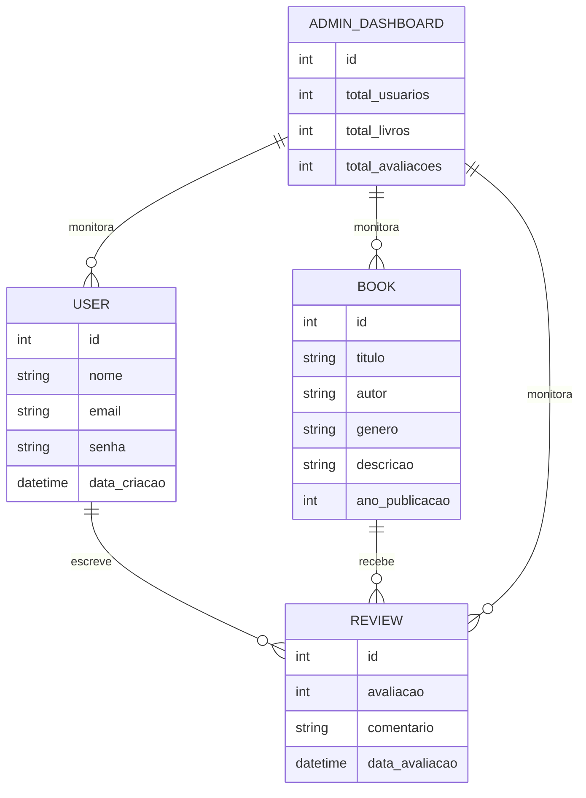

---

# Sistema de Recomendação de Livros com Inteligência Artificial

## Descrição
Este é um sistema de recomendação de livros que utiliza inteligência artificial para recomendar livros aos usuários com base em suas preferências e hábitos de leitura. A aplicação conta com um algoritmo de recomendação em tempo real, além de funcionalidades para cadastro de livros, avaliação por parte dos usuários, e um painel administrativo para visualização de métricas e tendências.

## Funcionalidades
- **Cadastro e Avaliação de Livros**: Usuários podem cadastrar novos livros e avaliá-los com estrelinhas e reviews.
- **Algoritmo de Recomendação**: Algoritmo que sugere livros com base nas preferências dos usuários, utilizando filtragem colaborativa ou baseada em conteúdo.
- **Recomendações em Tempo Real**: Implementação de Spring WebSocket para que as recomendações sejam atualizadas em tempo real conforme novas avaliações são feitas.
- **Dashboard Administrativo**: Área administrativa para monitoramento e análise de avaliações e tendências de leitura.
- **Integração com Banco de Dados**: MySQL ou PostgreSQL para armazenamento de dados dos usuários, livros e avaliações.
- **Autenticação e Segurança**: Implementação de OAuth2 ou JWT para autenticação segura.
- **Deploy na Nuvem**: Deploy na AWS (Elastic Beanstalk) ou Azure para escalabilidade e acesso global.

## Requisitos
- **Frontend**: Vue.js ou React (opcional).
- **Backend**: Spring Boot para gerenciamento de API e lógica de negócio.
- **Banco de Dados**: MySQL ou PostgreSQL.
- **Nuvem**: AWS ou Azure para deploy e escalabilidade.
- **WebSocket**: Spring WebSocket para atualização em tempo real.
- **Autenticação**: OAuth2 (Google ou GitHub) para login.

## Estrutura do Banco de Dados
Abaixo, o diagrama Entidade-Relacionamento (ER) em Mermaid:



## Configuração do Projeto

1. **Clone o Repositório**:
   ```bash
   git clone https://github.com/usuario/repo-sistema-recomendacao-livros.git
   cd repo-sistema-recomendacao-livros
   ```

2. **Configuração do Backend**:
   - Certifique-se de ter o [Java](https://www.oracle.com/java/technologies/javase-jdk11-downloads.html) e o [Maven](https://maven.apache.org/) instalados.
   - Configure as variáveis de ambiente para o banco de dados (ex: MySQL/PostgreSQL).
   - Compile e inicie o servidor:
     ```bash
     mvn clean install
     mvn spring-boot:run
     ```

3. **Configuração do Frontend (Opcional)**:
   - No diretório `frontend`, execute:
     ```bash
     npm install
     npm run serve
     ```

4. **Configuração para Deploy na Nuvem**:
   - Utilize o [Elastic Beanstalk CLI](https://docs.aws.amazon.com/elasticbeanstalk/latest/dg/eb-cli3-install.html) ou [Azure CLI](https://docs.microsoft.com/en-us/cli/azure/install-azure-cli) para deploy.

## Estrutura do Projeto
- `src/main/java` - Código-fonte do backend.
- `src/main/resources` - Configurações do projeto e arquivos de recursos.
- `frontend/` - Código do frontend (Vue.js ou React).
- `README.md` - Documentação do projeto.

## Autores
- Nome do Desenvolvedor: [Ana Clara Caldeira]
- GitHub: [[Link do GitHub](https://github.com/anaclaracald)]
  
---
